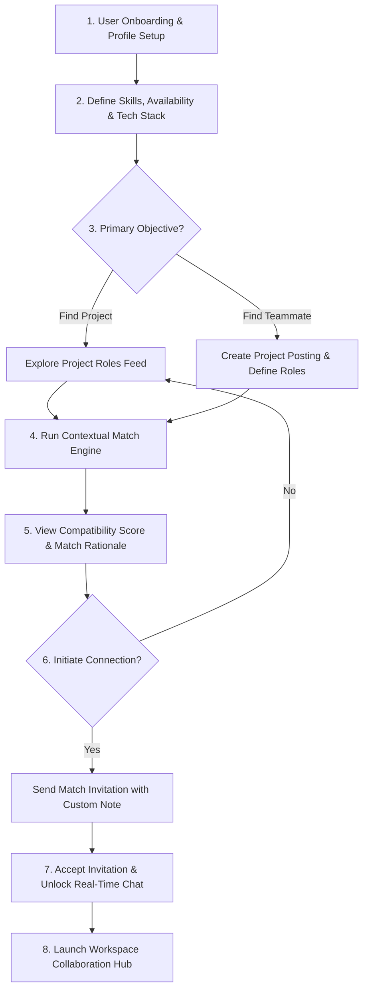
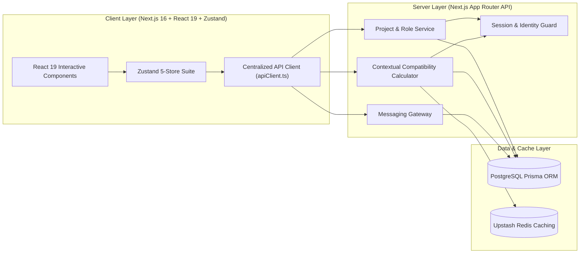
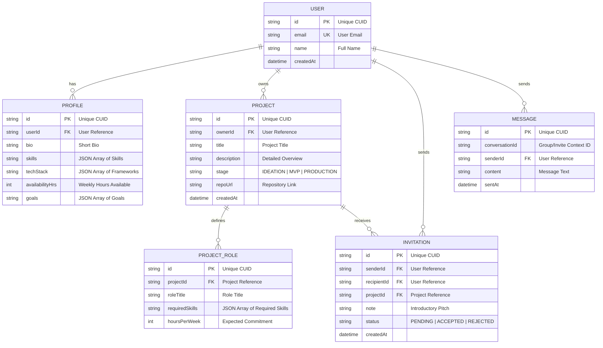

<!-- Piardify Context Snapshot | generatedAt: 2026-08-30T08:59:42.953Z | Freshness Gate AH-017: If project updatedAt is newer, refresh via .piardify/sync context > .piardify/context.md -->

<system_directives>
  <ui_governance>
    <surfaces base="#090A0C" level1="#121318" level2="#181A22" hover="#222634" primary_accent="#6366F1" />
    <radius data="0-4px" cards_inputs="4-8px" pills_only="9999px" />
    <typography headline_tracking="tight (-0.02em)" label_tracking="wide (+0.05em)" max_prose_chars="75" max_weights="3" />
    <motion duration="150-250ms" timing="cubic-bezier(0.16, 1, 0.3, 1)" />
    <mandate library="shadcn/ui (@/components/ui/*)" />
    <forbidden>
      [pure_black_#000000, navy_#0F172A, icon_container_syndrome, gradient_text_headlines, rounded-2xl_everywhere, nested_cards_gt_2, arbitrary_unapproved_libraries]
    </forbidden>
    <currency idr_billion="Rp X,XX M" idr_million="Rp X,XX Jt" idr_thousand="Rp XXX Rb" />
  </ui_governance>

  <anti_hallucination_rules>
  <rule id="AH-001">ZERO INVENTION: Never add unapproved libraries, frameworks, or dependencies outside explicit PRD specs.</rule>
  <rule id="AH-002">ZERO ASSUMPTION: Never assume database schemas, API contracts, response shapes, or undocumented business logic.</rule>
  <rule id="AH-003">STATUS SYNC: Update task status to 'in_progress' on start and 'done' upon verified completion via .piardify/sync.</rule>
  <rule id="AH-004">REALITY CHECK: Flag missing backend/API dependencies as blockers; never silent mock unverified endpoints.</rule>
  <rule id="AH-005">DESIGN SYSTEM SYNC: Verify design tokens in &lt;design_data&gt; before generating frontend components.</rule>
  <rule id="AH-006">CHECKPOINT HONOR: Stop and await user confirmation when encountering tasks marked [CHECKPOINT] or isCheckpoint: true.</rule>
  <rule id="AH-007">DESIGN TOKEN GROUND TRUTH: Use exact HEX colors and typography from &lt;design_data&gt;; never invent arbitrary colors.</rule>
  <rule id="AH-008">ZERO DUMMY DATA IN PRODUCTION: Replace all mock/dummy static arrays with real API and database seed data in Phase 6.</rule>
  <rule id="AH-009">MODERN CONVENTIONS VERIFICATION: Verify official latest framework conventions (Next.js 16 App Router, Turbopack, Better-Auth) before writing files.</rule>
  <rule id="AH-010">DEFINITION OF DONE: Strictly verify task completion criteria and acceptance criteria before marking done.</rule>
  <rule id="AH-011">DESIGN SKILL ROUTING: Activate and align with the specified taste skill key in &lt;system_directives&gt;.</rule>
  <rule id="AH-012">CURATED REACT BITS INTEGRATION: Integrate modern animations (Aurora, Spotlight, Waves) via reactbits.dev. Forbid cheesy slop (glitch cursors, neon overload).</rule>
  <rule id="AH-013">ON-DEMAND TASTE SKILL: Fetch full taste skill via .piardify/sync taste &lt;key&gt; for complex UI scaffolding.</rule>
  <rule id="AH-014">ZERO-SLOP VISUAL QUALITY: Ensure premium agency-grade aesthetics. Forbid default #0F172A navy, #000000 pure black, and uniform rounded-2xl.</rule>
  <rule id="AH-015">CONTEXT PERSISTENCE: Re-verify .piardify/context.md before starting new tasks to maintain 100% project memory.</rule>
  <rule id="AH-016">CHUNK-READ FOR LARGE FILES: Use chunked reading (StartLine/EndLine) for files &gt;800 lines to ensure zero truncated context.</rule>
  <rule id="AH-017">CONTEXT FRESHNESS: If project updatedAt is newer than snapshot generatedAt, refresh via .piardify/sync context &gt; .piardify/context.md.</rule>
  <rule id="AH-018">COMPREHENSIVE DESIGN COMPLIANCE: 100% adherence to design tokens, layout hierarchy, and typography constraints.</rule>
  <rule id="AH-019">MANDATORY FRONTEND DESIGN THINKING [CRITICAL]: Sebelum membuat atau mengubah komponen UI/UX Frontend, AI Agent WAJIB membaca dan menerapkan pemikiran utama dari skill '.agents/skills/frontend/SKILL.md' (Ground it in subject, distinctive typography/layout, intentional copy, deliberate motion, dan satu risiko estetika terjustifikasi tanpa mengulang template AI-slop).</rule>
  <rule id="AH-021">SHADCN/UI COMPONENT MANDATE: Use shadcn/ui primitives (@/components/ui/*) for all UI components. Never create raw unstyled HTML buttons/inputs.</rule>
  </anti_hallucination_rules>

  <active_skill key="designTasteFrontend" fetch_cmd=".piardify/sync taste designTasteFrontend">
    Selected: Auto-selected 'designTasteFrontend' — matched keyword(s): landing page, landing, saas | Baseline: Obsidian (#090A0C), 150-250ms spring physics, shadcn/ui mandatory, zero-slop.
  </active_skill>
</system_directives>

<project_context>
<![CDATA[
{"id":"cmtfkhvii0001l6049hrw1nxg","appName":"Devora","appIdea":"Devora is a web app that helps developers find the right partners for building projects together. Users create profiles based on skills, tech stack, availability, interests, and collaboration goals, then discover relevant developers or projects through matching. Instead of simply matching profiles, Devora focuses on project needs and compatibility, helping users understand why a match is relevant before starting a conversation and potential collaboration.","status":"IN_PROGRESS","createdAt":"2026-08-30T08:48:36.810Z","updatedAt":"2026-08-30T08:53:35.272Z"}
]]>
</project_context>

<personalization_inputs>
<![CDATA[
{"appName":"Devora","appIdea":"Devora is a web app that helps developers find the right partners for building projects together. Users create profiles based on skills, tech stack, availability, interests, and collaboration goals, then discover relevant developers or projects through matching. Instead of simply matching profiles, Devora focuses on project needs and compatibility, helping users understand why a match is relevant before starting a conversation and potential collaboration.","designData":"# Devora — Design System & UI Direction\n\n## 01. Product Design Philosophy\n\nDevora should feel like a **serious developer collaboration platform**, not a dating app with developer-themed colors.\n\nThe visual identity should communicate:\n\n- Technical confidence\n- Human collaboration\n- Discovery\n- Trust\n- Compatibility\n- Momentum\n\nThe interface should feel modern and distinctive without relying on common SaaS templates, excessive gradients, oversized rounded cards, glassmorphism, neon colors, or generic AI aesthetics.\n\n### Core Concept\n\n**\"Find someone worth building with.\"**\n\nThe visual language should combine:\n\n**Developer tooling precision + social discovery + editorial confidence**\n\nThe result should feel closer to a premium product for builders than a generic startup dashboard.\n\n---\n\n# 02. Design Principles\n\n## 2.1 Collaboration First\n\nDesign should constantly reinforce that Devora exists to help people **build together**.\n\nAvoid interfaces that feel like:\n\n- social media feeds;\n- dating profiles;\n- job boards;\n- recruitment dashboards.\n\n## 2.2 Information Has Hierarchy\n\nDeveloper profiles contain a lot of information. Do not show everything with equal visual weight.\n\nPrioritize:\n\n1. What they build\n2. What they can contribute\n3. What they are looking for\n4. Compatibility\n5. Evidence\n6. Secondary information\n\n## 2.3 Explain the Match\n\nA match should never feel like a mysterious AI decision.\n\nPrefer:\n\n> Strong backend fit  \n> Shared TypeScript stack  \n> Similar availability  \n> Both interested in SaaS projects\n\nInstead of:\n\n> 94% Compatible\n\nNumeric scores may be used later, but explanations are mandatory.\n\n## 2.4 Human + Technical\n\nTechnical metadata should coexist with human signals.\n\nExamples:\n\n```text\nReact\nTypeScript\nPostgreSQL\n```\n\nalongside:\n\n```text\nBuilding after work\nAvailable 6–8 hrs/week\nPrefers async collaboration\n```\n\n## 2.5 Avoid Generic SaaS Patterns\n\nDo not use:\n\n- huge hero with centered text and three CTA buttons;\n- excessive pill components;\n- gradient text;\n- glass cards everywhere;\n- floating blobs;\n- excessive shadow;\n- dashboard sidebar with dozens of menu items;\n- generic purple-blue AI gradients;\n- unnecessarily rounded interfaces.\n\n---\n\n# 03. Visual Personality\n\n### Keywords\n\n**Builder**\n**Focused**\n**Warm**\n**Precise**\n**Independent**\n**Curious**\n**Technical**\n**Human**\n\n### Emotional Goal\n\nThe user should feel:\n\n> \"There are actually people here who want to build something.\"\n\nNot:\n\n> \"This looks like another startup template.\"\n\n---\n\n# 04. Color System\n\nUse a warm off-white base combined with deep ink and a distinctive orange accent.\n\n## Core Palette\n\n```css\n:root {\n  --color-ink: #141817;\n  --color-ink-soft: #2A302D;\n\n  --color-background: #FCFBF8;\n  --color-surface: #F5F2EA;\n  --color-surface-strong: #EBE7DD;\n\n  --color-brand: #E85D3F;\n  --color-brand-dark: #C94A30;\n  --color-brand-soft: #F7D8D0;\n\n  --color-border: #D9D5CB;\n  --color-border-strong: #BDB8AC;\n\n  --color-muted: #77766F;\n  --color-muted-strong: #555650;\n\n  --color-success: #3E7A5A;\n  --color-warning: #B87824;\n  --color-danger: #B94A43;\n}\n```\n\n## Color Usage\n\n### Ink\n\nPrimary text, navigation, important headings.\n\n### Background\n\nMain page background.\n\n### Surface\n\nCards, profile sections, project blocks.\n\n### Brand\n\nPrimary actions, selected states, highlights, match indicators.\n\n### Brand Soft\n\nSubtle contextual backgrounds.\n\n### Border\n\nUse visible but quiet borders instead of heavy shadows.\n\n---\n\n# 05. Typography\n\nTypography should feel editorial and technical.\n\n## Preferred Stack\n\n```css\nfont-family:\n  Inter,\n  ui-sans-serif,\n  system-ui,\n  -apple-system,\n  BlinkMacSystemFont,\n  \"Segoe UI\",\n  sans-serif;\n```\n\nFor large display headings, a contrasting serif may be used selectively:\n\n```css\nfont-family:\n  \"Instrument Serif\",\n  Georgia,\n  serif;\n```\n\nDo not use serif typography everywhere.\n\n### Typography Hierarchy\n\n```text\nDisplay\n56–72px\nWeight: 500–600\n\nH1\n44–56px\nWeight: 600\n\nH2\n32–40px\nWeight: 600\n\nH3\n22–28px\nWeight: 600\n\nBody Large\n18–20px\n\nBody\n15–17px\n\nMeta\n12–14px\n```\n\nLarge typography should be intentional rather than oversized for decoration.\n\n---\n\n# 06. Layout System\n\nUse a responsive grid with strong alignment.\n\n## Desktop\n\n```text\nmax-width: 1280px\nhorizontal padding: 32px\ngrid gap: 24px\n```\n\n## Tablet\n\n```text\nhorizontal padding: 24px\ngrid gap: 20px\n```\n\n## Mobile\n\n```text\nhorizontal padding: 16px\ngrid gap: 16px\n```\n\nAvoid excessive empty space.\n\nLayouts should feel **dense enough to communicate product intelligence**, but never crowded.\n\n---\n\n# 07. Shape Language\n\nDevora should use restrained geometry.\n\n### Radius\n\n```text\nInputs: 8px\nButtons: 8px\nCards: 14px\nLarge containers: 18px\nModal/dialog: 18px\n```\n\nAvoid:\n\n```text\nfully rounded buttons\npill-shaped cards\ngiant 32–40px radius containers\n```\n\nPills are acceptable only for metadata such as skills or status.\n\n---\n\n# 08. Borders & Elevation\n\nDefault visual hierarchy should come from:\n\n1. spacing;\n2. typography;\n3. background contrast;\n4. borders;\n5. subtle shadow.\n\nAvoid heavy shadows.\n\n### Default Card\n\n```css\nborder: 1px solid var(--color-border);\nbackground: var(--color-surface);\nborder-radius: 14px;\n```\n\n### Elevated Card\n\nUse only where necessary.\n\n```css\nbox-shadow:\n  0 10px 30px rgba(20, 24, 23, 0.06);\n```\n\nNever make every component appear elevated.\n\n---\n\n# 09. Core Interaction Model\n\nDevora should not literally copy Tinder.\n\nThe interaction model should be:\n\n```text\nDiscover\n   ↓\nInspect\n   ↓\nUnderstand\n   ↓\nExpress Interest\n   ↓\nMutual Match\n   ↓\nTalk\n   ↓\nCollaborate\n```\n\n## Discover\n\nUsers see people or projects relevant to their intent.\n\n## Inspect\n\nOpening a card reveals more detail.\n\n## Understand\n\nThe system clearly explains compatibility.\n\n## Interest\n\nThe user can express interest without committing to collaboration.\n\n## Match\n\nBoth parties express interest.\n\n## Talk\n\nA conversation opens.\n\n## Collaborate\n\nUsers can decide whether to work together.\n\n---\n\n# 10. Signature UI — Match Explanation\n\nThis should be one of Devora's strongest visual components.\n\nExample:\n\n```text\nWHY THIS MATCH\n\nStrong backend fit\nYour project needs backend architecture\nand Alex works primarily with Node.js\nand PostgreSQL.\n\nShared stack\nTypeScript · PostgreSQL\n\nAvailability\nBoth available evenings\n\nProject alignment\nBoth interested in SaaS\n```\n\nVisual treatment:\n\n- small uppercase label;\n- bold primary signal;\n- muted explanation;\n- small supporting metadata.\n\nDo not make this look like an AI-generated recommendation widget.\n\n---\n\n# 11. Developer Profile Design\n\nProfile should resemble a **builder identity card**, not a social media profile.\n\n## Structure\n\n```text\nAvatar        Name\n              Role\n              Location / Timezone\n\nShort statement\n\nPRIMARY SKILLS\nReact · TypeScript · Node.js\n\nBUILDING\nCurrent project / selected project\n\nLOOKING FOR\nBackend collaborator\nSide projects\n5–8 hrs/week\n\nEXPERIENCE\nSelected project evidence\n\nAVAILABILITY\nWeekday evenings\n\nCOLLABORATION\nAsync-first\n```\n\nThe profile should answer:\n\n> Who are you?\n> What can you build?\n> What are you looking for?\n> Can we realistically work together?\n\n---\n\n# 12. Project Card\n\nProject cards should prioritize the opportunity rather than the owner.\n\nExample:\n\n```text\nBUILDING\n\nMoryn\n\nAI-powered PRD generation platform.\n\nNEED\nBackend Engineer\nAI Engineer\n\nSTACK\nNext.js\nPostgreSQL\nTypeScript\n\nCOMMITMENT\n5–8 hrs/week\n\nSTAGE\nPrototype\n```\n\nUse compact metadata and strong typography.\n\n---\n\n# 13. Discover Page\n\nThe Discover page is the primary product surface.\n\nAvoid a conventional marketplace grid.\n\nPreferred structure:\n\n```text\n------------------------------------------------\nDiscover\n\n[ Find People ] [ Find Projects ]\n\nRecommended for you\n-----------------------------------------------\n\nFeatured match\nLarge candidate/project card\n\nWHY THIS MATCH\n...\n\n-----------------------------------------------\n\nMore people / projects\nCompact horizontal cards\n------------------------------------------------\n```\n\nThe first recommendation should have more visual weight than secondary recommendations.\n\n---\n\n# 14. Filtering\n\nFiltering should stay simple.\n\nPrimary filters:\n\n```text\nRole\nSkills\nTech Stack\nProject Type\nAvailability\nCommitment\nExperience\nTimezone\n```\n\nDo not expose every possible filter immediately.\n\nUse progressive disclosure for advanced filters.\n\n---\n\n# 15. Navigation\n\nDesktop navigation should stay minimal.\n\nRecommended:\n\n```text\nLogo\n\nDiscover\nProjects\nMatches\nMessages\n\n----------------\n\nProfile\nSettings\n```\n\nAvoid a complex dashboard navigation hierarchy.\n\nMobile should use:\n\n```text\nDiscover\nProjects\nMatches\nMessages\nProfile\n```\n\nas bottom navigation.\n\n---\n\n# 16. Landing Page\n\nThe landing page should introduce the problem before explaining the mechanics.\n\n## Hero Direction\n\nDo not use:\n\n> \"The Tinder for Developers\"\n\nInstead communicate:\n\n> **Find the right person to build with.**\n\nSupporting copy:\n\n> Match with developers whose skills, goals, and availability actually fit your project.\n\nPrimary CTA:\n\n```text\nFind collaborators\n```\n\nSecondary CTA:\n\n```text\nExplore projects\n```\n\n### Visual\n\nThe hero should contain a **living collaboration composition**, not a generic illustration.\n\nPotential composition:\n\n```text\nPROJECT\nMoryn\n\nneeds\nBackend Engineer\n\n        +\n\nDEVELOPER\nAlex\nNode.js · PostgreSQL\n\n        ↓\n\nMATCH\nShared stack\nAligned availability\nSame project interest\n```\n\nThis visually communicates the product's value immediately.\n\n---\n\n# 17. Login / Register\n\nAuthentication should remain extremely simple.\n\nPrimary:\n\n```text\nContinue with GitHub\n```\n\nOptional future provider:\n\n```text\nContinue with Google\n```\n\nDo not use credential forms unless required later.\n\nVisual design should remain consistent with the landing page.\n\n---\n\n# 18. Empty States\n\nEmpty states should be useful, not decorative.\n\nBad:\n\n> \"Nothing here yet!\"\n\nGood:\n\n```text\nNo strong matches yet.\n\nYour current requirements are very specific.\nTry expanding the required stack or availability.\n\n[Adjust requirements]\n```\n\nEmpty states should explain what happened and what the user can do next.\n\n---\n\n# 19. Loading States\n\nAvoid generic spinner-only screens.\n\nUse skeleton structures that resemble the actual content.\n\nExample:\n\n```text\n[avatar] ███████████\n         ███████\n\n██████████████████\n████████████\n\n██████  █████  █████\n```\n\nLoading should feel like the interface is progressively assembling.\n\n---\n\n# 20. Motion\n\nMotion should communicate interaction, not decoration.\n\n### Motion Intensity\n\n**Medium**\n\nUse:\n\n- subtle card entrance;\n- hover elevation;\n- filter transitions;\n- panel transitions;\n- match confirmation;\n- message appearance.\n\nAvoid:\n\n- constant floating animations;\n- excessive parallax;\n- bouncing UI;\n- decorative particle effects.\n\n### Timing\n\n```text\nmicro interaction: 120–180ms\ncomponent transition: 180–260ms\npage transition: 250–350ms\n```\n\nUse ease-out curves for most UI transitions.\n\n---\n\n# 21. Responsive Behavior\n\nMobile is not a compressed desktop version.\n\n## Desktop\n\nUse:\n\n- multi-column discovery;\n- persistent navigation;\n- profile side panels;\n- larger match explanation.\n\n## Mobile\n\nUse:\n\n- bottom navigation;\n- stacked profile information;\n- full-width cards;\n- collapsible match explanation;\n- sticky primary action.\n\nThe primary interaction should remain comfortable with one hand.\n\n---\n\n# 22. Accessibility\n\nRequirements:\n\n- WCAG-conscious contrast;\n- keyboard navigation;\n- visible focus states;\n- semantic HTML;\n- accessible labels;\n- no interaction dependent solely on color;\n- minimum touch target around 44px;\n- reduced-motion support.\n\nNever use orange/red alone to communicate important state.\n\n---\n\n# 23. Component Rules\n\n## Buttons\n\nPrimary:\n\n```text\nBackground: brand\nText: white\nRadius: 8px\nHeight: 42–46px\n```\n\nSecondary:\n\n```text\nBackground: transparent\nBorder: border\nText: ink\n```\n\nDo not create five competing button styles.\n\n## Inputs\n\n```text\nHeight: 44–48px\nBorder: 1px solid border\nRadius: 8px\nBackground: background\n```\n\nFocus:\n\n```text\nborder-color: brand\n```\n\n## Tags\n\nUse pills only for:\n\n- skills;\n- technologies;\n- project type;\n- status.\n\nTags should remain compact.\n\n---\n\n# 24. Data Density\n\nDeveloper products require higher information density than consumer social apps.\n\nRecommended density:\n\n```text\nPrimary information\n↓\nSupporting context\n↓\nMetadata\n↓\nOptional evidence\n```\n\nDo not solve complexity by hiding everything behind tabs.\n\nImportant information should remain visible.\n\n---\n\n# 25. Trust & Authenticity\n\nDevora must avoid creating a fake sense of trust.\n\nDo not automatically label users:\n\n```text\nVerified Developer\nTop Developer\nExpert\n```\n\nunless the product has a real verification mechanism.\n\nPrefer factual signals:\n\n```text\nGitHub connected\n3 public projects\nAvailable 6 hrs/week\nLooking for backend collaboration\n```\n\nThe UI should distinguish:\n\n**Claim**\n\nfrom\n\n**Evidence**\n\n---\n\n# 26. Design Anti-Patterns\n\nNever introduce:\n\n- neon purple AI gradients;\n- excessive glassmorphism;\n- giant rounded containers;\n- fake 3D elements;\n- random blobs;\n- excessive emoji;\n- generic dashboard widgets;\n- fake AI scores;\n- decorative charts with no decision value;\n- excessive badges;\n- fake verification;\n- \"AI-powered\" labels everywhere.\n\nThe product should look like it was designed for developers who value signal over decoration.\n\n---\n\n# 27. Design Dials\n\nUse these variables when designing new screens.\n\n```text\nDESIGN_VARIANCE = 7/10\nMOTION_INTENSITY = 4/10\nVISUAL_DENSITY = 7/10\n```\n\n### DESIGN_VARIANCE\n\nHigher than conventional SaaS.\n\nLayouts should feel original but still usable.\n\n### MOTION_INTENSITY\n\nModerate.\n\nMotion is functional, not theatrical.\n\n### VISUAL_DENSITY\n\nModerately high.\n\nDevelopers need enough information to evaluate collaborators quickly.\n\n---\n\n# 28. Overall UI Direction\n\nDevora should feel like:\n\n```text\nLinear\n+\nGitHub\n+\nEditorial product design\n+\nHuman collaboration\n```\n\nBut it must **not copy the visual language of any of them directly**.\n\nThe final product should have its own recognizable identity:\n\n> **Warm off-white surfaces**\n> + **deep ink typography**\n> + **orange moments of interaction**\n> + **structured information**\n> + **editorial composition**\n> + **human collaboration signals**\n\nThe visual system should make the product immediately recognizable even without the Devora logo.\n\n---\n\n# 29. Quality Bar\n\nBefore shipping any screen, ask:\n\n1. Does this look like a developer collaboration product rather than a generic SaaS dashboard?\n2. Can the user understand the purpose within a few seconds?\n3. Is the most important information visually dominant?\n4. Does the screen explain compatibility instead of merely claiming it?\n5. Is there unnecessary decoration?\n6. Does the screen remain useful at mobile width?\n7. Are claims backed by actual product data?\n8. Does the interface avoid common AI/SaaS design clichés?\n\nIf the answer to several questions is \"no\", redesign before adding more features.\n","dynamicAnswers":{"matchingAlgorithmFocus":["Shared domain interests and project goals (e.g., Web3, Open Source, SaaS)","Complementary skill sets (e.g., UI/UX designer paired with Backend dev)","Time zone alignment and weekly hour availability","Tech stack overlap and framework familiarity"],"projectDiscoveryMode":"Project-first: Developers browse and apply to active project listings & Dual-sided: Both project applications and direct profile invites are equal","initialCommunicationFlow":["In-app real-time chat messaging","Structured project proposal / application form","External contact link sharing (Discord, Slack, Telegram)","Collaboration agreement/alignment questionnaire before chat opens"],"profileVerificationMethods":["GitHub repository and commit activity parsing","Imported portfolio links and live demo URLs","Self-reported skills with project showcase attachments"],"notificationStrategy":["Personalized daily/weekly email digests of top matches","In-app notifications feed","Browser web push notifications"],"projectLifecycleManagement":"Lightweight workspace: Built-in milestone tracking and task boards","searchAndFilteringCapabilities":["Granular tech stack filters (e.g., Next.js, PostgreSQL, Tailwind)","Weekly commitment level (e.g., <5 hrs/wk, 10-20 hrs/wk, full-time)","Compensation or collaboration model (Hobby/Free, Rev-Share, Equity, Paid)","Geographic location & preferred working language","Project phase (Brainstorming, Early MVP, Beta, Live)"]}}
]]>
</personalization_inputs>

<structure>
<![CDATA[
{"title":"Devora","description":"Compatibility-driven partner matching platform connecting developers for collaborative projects.","nodes":[{"id":"profile-management","label":"Developer Profiles & Identity","phase":1,"color":"#6366f1","children":[{"id":"github-sync","label":"GitHub and GitLab Profile Sync"},{"id":"tech-skill-matrix","label":"Tech Stack and Skill Matrix"},{"id":"availability-settings","label":"Availability and Timezone Settings"},{"id":"collaboration-style","label":"Collaboration Goals and Work Style"}]},{"id":"project-management","label":"Project Needs & Postings","phase":1,"color":"#3b82f6","children":[{"id":"project-post-creation","label":"Project Idea Post Creation"},{"id":"required-stack-mapping","label":"Required Tech Stack Mapping"},{"id":"role-requirements","label":"Role Requirements and Commitment Level"},{"id":"project-stage-tags","label":"Project Stage and Roadmap Tags"}]},{"id":"compatibility-engine","label":"Intelligent Compatibility Engine","phase":1,"color":"#06b6d4","children":[{"id":"relevance-score","label":"Match Relevance Score Algorithm"},{"id":"match-breakdown","label":"Why We Matched Breakdown Card"},{"id":"skill-complementarity","label":"Skill Complementarity Insights"},{"id":"timezone-overlap","label":"Schedule and Timezone Overlap Matrix"}]},{"id":"discovery-search","label":"Developer & Project Discovery","phase":2,"color":"#10b981","children":[{"id":"filter-panel","label":"Multi-Parametric Filter Panel"},{"id":"match-feed","label":"Grid Match Feed and Card View"},{"id":"interest-signals","label":"Express Interest and Bookmark Queue"},{"id":"bidirectional-search","label":"Developer to Project Search Mode"}]},{"id":"communication-onboarding","label":"Communication & Match Onboarding","phase":2,"color":"#8b5cf6","children":[{"id":"in-app-chat","label":"Direct In-App Messaging"},{"id":"collaboration-invites","label":"Collaboration Request Management"},{"id":"icebreaker-prompts","label":"Contextual Project Icebreaker Prompts"},{"id":"external-links","label":"External Workspace Link Integration"}]},{"id":"reputation-synergy","label":"Reputation & Synergy Verification","phase":3,"color":"#f97316","children":[{"id":"peer-reviews","label":"Post-Collaboration Peer Reviews"},{"id":"verified-proof","label":"Verified Skill Badges and Commit Proofs"},{"id":"activity-scorecard","label":"Reliability and Activity Scorecard"},{"id":"endorsements","label":"Community Tech Stack Endorsements"}]}]}
]]>
</structure>

<prd_document>
<![CDATA[
# Product Requirements Document (PRD)

## Devora — Developer Matchmaking & Project Collaboration Platform

---

## 1. Overview & Objectives

### 1.1 Product Summary
**Devora** is a high-tech developer matchmaking and project discovery web application designed to help software engineers, open-source maintainers, and tech co-founders find compatible project partners. Unlike generic job boards or unstructured developer lists, Devora focuses on **project-specific needs and contextual compatibility scoring**. By analyzing skills, tech stacks, availability, collaboration goals, and work styles, Devora provides transparent match explanations ("Why This Match Works") before developers initiate contact.

### 1.2 Core Problem & Solution
* **Problem**: Finding reliable, aligned developer partners for side projects or early-stage products is notoriously difficult. Generic communities (Discord/Reddit) lack structured availability and skill verification, leading to high ghosting rates, misaligned expectations, and failed collaborations.
* **Solution**: Devora introduces a structured profile & project matrix paired with a contextual **Compatibility Scoring Engine**. Users gain actionable insights into *why* a potential partner fits a specific role—highlighting shared tech stacks, overlapping availability, and complementary skill sets—to maximize successful project outcomes.

### 1.3 Success Metrics (KPIs)
* **Match-to-Conversation Rate**: $\ge 35\%$ of viewed high-compatibility matches result in an invitation request.
* **Invitation Acceptance Rate**: $\ge 50\%$ of match invitations accepted within 48 hours.
* **User Engagement**: Average of 3 active project role applications or candidate evaluations per weekly active user (WAU).
* **System Performance**: Compatibility scoring calculations delivered in $< 200\text{ms}$.

---

## 2. User Personas & Pain Points

### 2.1 Solo Developers & Indie Hackers
* **Pain Point**: Strong in backend or frontend, but missing complementary skills (e.g., UI/UX design, DevOps, mobile dev) to build a complete product.
* **Solution**: Project-centric role posting that matches them with developers holding exact missing skill sets and aligned commitment hours.

### 2.2 Tech Co-Founders & Project Leads
* **Pain Point**: Wasting time vetting candidates who lack the necessary time availability or share different project goals (hobby vs. startup commercialization).
* **Solution**: Clear goal markers (e.g., *Open Source, Portfolio Builder, Startup MVP*) and verifiable weekly availability parameters.

### 2.3 Student Developers & Early-Career Engineers
* **Pain Point**: Struggling to find real-world collaborative projects to build a solid portfolio.
* **Solution**: Accessible discovery feed filtering for beginner-friendly projects seeking enthusiastic contributors.

---

## 3. End-to-End User Flow & Journey



---

## 4. Functional Requirements & Feature Matrix

### Mandatory Design System & React Bits Directives
* **Design Token Reference**: Complete color palettes (Obsidian #090A0C, Surface #121318, Neon Accent #6366F1), typography hierarchy, and UI component standards are maintained in `design.md` (`designData`). All implemented interfaces MUST strictly conform to `design.md`.
* **Zero-Slop UI Mandate**: Strictly prohibit generic designs: ZERO default navy containers (`#0F172A`), ZERO flat pure black (`#000000`) surfaces, ZERO badge-stuffed headings, ZERO uniform `rounded-2xl` on all elements. Interfaces MUST use intentional dark obsidian layers, fluid micro-interactions (150-250ms), purposeful whitespace, and tactile visual states.
* **Curated React Bits Integration**: Web interfaces MUST integrate dynamic components from React Bits (`reactbits.dev`) tailored to Devora's high-tech developer aesthetic (e.g., *Spotlight Cards* for project roles, *Magnet Buttons* for primary actions, *Waves / Animated Grid* for subtle background depth, and *Decrypted Text / Blur Text* for match highlights).

| ID | Module Name | User Story & Functionality | Acceptance Criteria |
| :--- | :--- | :--- | :--- |
| **FR-01** | **Developer Profile Builder** | As a developer, I want to detail my technical stack, experience level, availability, and collaboration goals so that matches are accurate. | Profile saves skills (JSON tags), availability (hrs/week), preferred roles, and goals; supports real-time form validation. |
| **FR-02** | **Project & Role Posting Manager** | As a project lead, I want to post my project details and specify exact open roles with required skill sets. | Supports multi-role project creation, stage tags (Ideation, MVP, Production), and detailed role responsibilities. |
| **FR-03** | **Contextual Match & Scoring Engine** | As a user, I want to see a compatibility percentage along with explicit reasons why a project/developer fits my profile. | Renders visual score breakdown (0-100%) and generates 3 key matching reasons (e.g., "Both active 10+ hrs/wk", "Complementary React/Node stack"). |
| **FR-04** | **Interactive Discovery Hub** | As a user, I want to filter and search projects or developers based on stack, commitment, and alignment. | Interactive filtering with live search; renders React Bits *Spotlight Cards* displaying tech tags and compatibility badges. |
| **FR-05** | **Match Invitation & Messaging System** | As a user, I want to send a match request with a proposal note and chat once accepted. | Sends structured invite; upon acceptance, creates a secure direct messaging channel with markdown support. |
| **FR-06** | **Collaboration Workspace Preview** | As a matched team, we want a shared workspace overview showing project milestones and contact handles. | Displays active project team, milestone checklist, repository links, and quick communication shortcuts. |
| **FR-07** | **Dynamic Micro-Interactivity** | As a user, I want smooth, modern UI visual feedback during interactions. | Employs *Magnet Buttons* on main CTAs, tactile hover states on role cards, and subtle background *Waves* without frame drops. |

---

## 5. System Architecture & Component Interactions



---

## 6. API Specifications & Data Contracts

| Method | Endpoint Path | Request Payload Schema | Expected Response Schema (200 OK) |
| :--- | :--- | :--- | :--- |
| `POST` | `/api/users/profile` | `{ bio: string, skills: string[], techStack: string[], availabilityHrs: number, goals: string[] }` | `{ success: true, profileId: string }` |
| `GET` | `/api/users/profile/me` | `None` | `{ profile: ProfileDataObject }` |
| `POST` | `/api/projects/create` | `{ title: string, description: string, stage: string, repoUrl?: string, roles: RoleObject[] }` | `{ success: true, projectId: string }` |
| `GET` | `/api/projects/discover` | `?skills=react,node&availability=10&page=1` | `{ projects: ProjectCardObject[], totalPages: number }` |
| `POST` | `/api/match/calculate` | `{ targetUserId?: string, targetProjectId?: string }` | `{ score: number, reasons: string[], stackOverlap: string[] }` |
| `POST` | `/api/invitations/send` | `{ recipientUserId: string, projectId: string, note: string }` | `{ invitationId: string, status: "PENDING" }` |
| `POST` | `/api/invitations/respond`| `{ invitationId: string, action: "ACCEPT" \| "REJECT" }` | `{ success: true, conversationId?: string }` |
| `GET` | `/api/messages/list` | `?conversationId=string` | `{ messages: MessageObject[] }` |
| `POST` | `/api/messages/send` | `{ conversationId: string, content: string }` | `{ messageId: string, sentAt: string }` |

---

## 7. Data Model & Database Schema



---

## 8. Tech Stack, State Management & Architecture

* **Core Framework**: Next.js 16 (App Router, Turbopack), React 19, TypeScript.
* **Component Architecture (`app/components/`)**:
  * `layout/`: Topbar, Navigation, Shell, Footer.
  * `profile/`: SkillMatrixEditor, AvailabilitySlider, GoalSelector.
  * `projects/`: ProjectCard (*Spotlight Card*), RoleRequirementForm, ProjectDetailModal.
  * `match/`: CompatibilityScoreBadge, RationaleList (*Blur Text / Decrypted Text*), MatchBreakdownModal.
  * `messaging/`: ChatDrawer, ConversationList, ProposalCard.
  * `ui/`: Custom button primitives (*Magnet Button*), ambient backgrounds (*Waves*), modern skeletons.
* **Global State Management (Zustand 5-Store Suite)**:
  * `useUserStore`: Handles active session state, developer profile data, and preference settings.
  * `useProjectStore`: Caches project listings, active project draft state, and role filters.
  * `useMatchStore`: Manages realtime calculated compatibility scores and cached rationale lists.
  * `useChatStore`: Controls active messaging sessions, invitation counts, and message delivery states.
  * `useUiStore`: Manages global modal visibility, drawer states, and UI toast notifications.
* **Database & ORM**: PostgreSQL with Prisma ORM v6 (using indexes on `[userId]`, `[projectId]`, and composite index `[ownerId, createdAt]`).
* **Caching Layer**: Upstash Redis (caching high-frequency match calculations and sliding window rate limiting).
* **Context Persistence & Re-Verification Protocol**: The development execution agent MUST re-verify context files (`.moryn/context.md` and `design.md`) prior to performing architectural or feature changes to guarantee complete alignment with tokenized specifications.

---

## 9. Non-Functional Requirements & Security Guidelines

* **Performance & Latency SLAs**:
  * Initial page rendering $< 1.2$ seconds.
  * Tab navigation latency powered by Zustand client memory cache: **0ms network delay**.
  * Dynamic match matrix query execution $< 150\text{ms}$.
* **Security & Access Control**:
  * Secure HTTP-Only cookie session guards on all protected API routes (`/api/projects/*`, `/api/match/*`, `/api/messages/*`).
  * Compound authorization queries (`where: { id, ownerId }`) ensuring users can only edit owned project postings and personal profiles.
  * Data input sanitization for all markdown message inputs and project descriptions to prevent XSS.
* **Design System Reference**:
  * All surface specifications, typography tokens, border radii, and visual hierarchies strictly reference `design.md` (`designData`).

---

## 10. Implementation Roadmap & Milestones

* **Phase 1: Core Foundation & Authenticated Profile Matrix**
  * Establish Next.js 16 platform boilerplate, PostgreSQL Prisma schema, and session guards.
  * Build Developer Profile Builder (`FR-01`) with skill tags, availability sliders, and goal selectors.
* **Phase 2: Project Management & Role Specifications**
  * Implement Project Creation wizard (`FR-02`) with multi-role definition capabilities.
  * Build basic project CRUD APIs and Zustand `useProjectStore` integration.
* **Phase 3: Contextual Match Engine & Compatibility Scoring**
  * Develop context-aware scoring algorithm comparing candidate profiles against open project roles (`FR-03`).
  * Implement Redis caching layer for fast score retrieval and match reason generation.
* **Phase 4: Match Discovery Suite & High-Tactile React Bits UI**
  * Build Interactive Discovery Hub (`FR-04`) with multi-parametric filtering (stack, hours, goals).
  * Integrate React Bits visual components (*Spotlight Cards*, *Magnet Buttons*, *Decrypted Text*) conforming to `design.md`.
* **Phase 5: Real-Time Match Invitations & Messaging Sandbox**
  * Build invitation dispatch & response workflows (`FR-05`).
  * Implement messaging drawer and real-time conversation views via API polling / gateway hooks.
* **Phase 6: Collaboration Workspace, System Hardening & Optimization**
  * Implement Collaboration Workspace Preview (`FR-06`) for matched teams.
  * Execute latency optimizations, zero-slop UI verification, and context persistence validation.
]]>
</prd_document>

<design_data>
  <color_tokens>
<![CDATA[
[{"token":"--color-ink","hex":"#141817","role":"Color Token"},{"token":"--color-ink-soft","hex":"#2A302D","role":"Color Token"},{"token":"--color-background","hex":"#FCFBF8","role":"Color Token"},{"token":"--color-surface","hex":"#F5F2EA","role":"Color Token"},{"token":"--color-surface-strong","hex":"#EBE7DD","role":"Color Token"},{"token":"--color-brand","hex":"#E85D3F","role":"Color Token"},{"token":"--color-brand-dark","hex":"#C94A30","role":"Color Token"},{"token":"--color-brand-soft","hex":"#F7D8D0","role":"Color Token"},{"token":"--color-border","hex":"#D9D5CB","role":"Color Token"},{"token":"--color-border-strong","hex":"#BDB8AC","role":"Color Token"},{"token":"--color-muted","hex":"#77766F","role":"Color Token"},{"token":"--color-muted-strong","hex":"#555650","role":"Color Token"},{"token":"--color-success","hex":"#3E7A5A","role":"Color Token"},{"token":"--color-warning","hex":"#B87824","role":"Color Token"},{"token":"--color-danger","hex":"#B94A43","role":"Color Token"}]
]]>
  </color_tokens>
</design_data>

<task_list>
<![CDATA[
{"phasesOverview":[{"id":"phase-1","name":"Desain Sistem","total":2,"done":0},{"id":"phase-2","name":"Setup Base","total":2,"done":0},{"id":"phase-3","name":"UI Frontend","total":25,"done":0},{"id":"phase-4","name":"Backend API","total":6,"done":0},{"id":"phase-5","name":"Integrasi Fullstack","total":2,"done":0},{"id":"phase-6","name":"Audit Final","total":1,"done":0}],"activeTasksWindow":[{"id":"task-1-1","phaseName":"Desain Sistem","title":"Setup Token Warna, Tipografi, dan Komponen Dasar UI (design.md)","status":"todo","estimasi":"1 hari","description":"Menerapkan token warna Obsidian (#090A0C), Surface (#121318), Neon Accent (#6366F1), font developer, spacing, dan styling shadow sesuai panduan `design.md` ke dalam Tailwind CSS config / global CSS.","definitionOfDone":"Semua token warna, font, dan variabel CSS terdefinisi di project dan dapat diimpor secara konsisten."},{"id":"task-1-2","phaseName":"Desain Sistem","title":"[CHECKPOINT] Review & ACC Token Desain (design.md) & Arsitektur dengan User","status":"todo","estimasi":"0.5 hari","description":"Melakukan peninjauan awal token visual, struktur UI kit, dan keselarasan arsitektur Next.js 16 + Tailwind CSS bersama user sebelum melangkah ke setup workspace.","definitionOfDone":"User mengonfirmasi dan menyetujui token visual serta fondasi desain sistem."},{"id":"task-2-1","phaseName":"Setup Base","title":"Inisialisasi Project Workspace & Routing Layout Utama","status":"todo","estimasi":"1 hari","description":"Mengkonfigurasi project Next.js 16 App Router dengan TypeScript, Tailwind CSS, Lucide icons, dan struktur folder `app/components/` (layout, profile, projects, match, messaging, ui).","definitionOfDone":"Struktur folder aplikasi terbuat dan layout dasar (Topbar & Navigation Shell) dapat dirender tanpa error."}],"taskStatuses":{}}
]]>
</task_list>